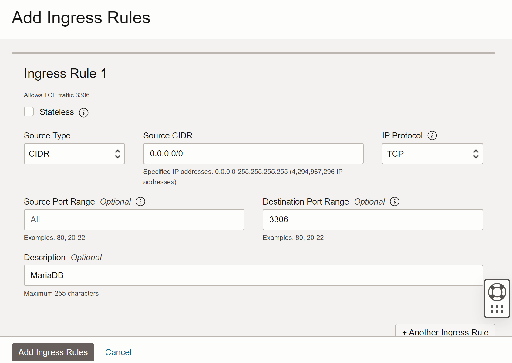
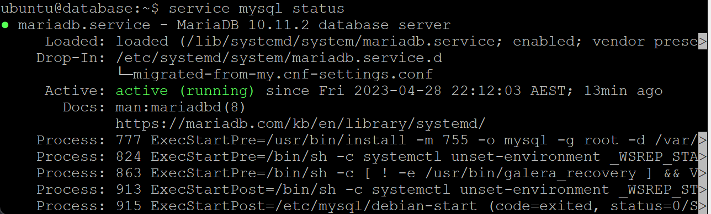

# Setup MariaDB in Ubuntu (Oracle Cloud)

After deploy the side project on the cloud, I need DB on the network not a local environment. I can make 2 free instance in oracle cloud, so I made another instance for database. I've been using Maria DB in my project, I decided to setup Maria DB in the instance.
 
### (Pre Setting) Cloud Security - Set Ingress Rules
Default Port of Maria DB is 3306, so I need to open 3306 VCN(Virtual Cloud Network) port in the setting. Ingress rules or Egress rules can be set in the path below.

`Oracle Webpage - Networking - Virtual cloud networks - 'Personal VCN' - Security List Details`



* Source CIDR : 0.0.0.0.0 -> Accessible from all ip (127.0.0.1 -> localhost)
* Destination Port Range : 3306

### Ubuntu Setting
* Set a password for root account of ubuntu
```
$ sudo passwd root
New password:
Retype UNIX password:
passwd: password updated successfully
```
* Modify a timezone, UTC is default.
```
$date
Fri Apr 28 10:52:05 UTC 2023

$sudo dpkg-reconfigure tzdata

Current default time zone: 'Australia/Sydney'
Local time is now:      Fri Apr 28 20:53:28 AEST 2023.
Universal Time is now:  Fri Apr 28 10:53:28 UTC 2023.
```
* apt package manager update and upgrade
```
$ sudo apt update
$ sudo apt upgrade
```

### Install Maria DB
I referred document at [Maria DB Official Webpage](https://mariadb.org/download/). I installed 10.11 the latest version.

First, set the MariaDB 10.11 version from MariaDB repository:
```
$ sudo apt-get install apt-transport-https curl
$ sudo curl -o /etc/apt/trusted.gpg.d/mariadb_release_signing_key.asc 'https://mariadb.org/mariadb_release_signing_key.asc'
$ sudo sh -c "echo 'deb https://mirror.realcompute.io/mariadb/repo/10.11/ubuntu kinetic main' >>/etc/apt/sources.list"
```
Then, you can install MariaDB from MariaDB repository:
```
$ sudo apt-get update
$ sudo apt-get install mariadb-server
```

### Initial Setting Maria DB
After install maria DB successfully, you should set a password.
```
$ sudo mysql_secure_installation
```
 * Current Password (if exist)
```
Enter current password for root (enter for none):
OK, successfully used password, moving on...
```

* Switch to unix socket authentication - n
```
Switch to unix_socket authentication [Y/n] n

You already have your root account protected, so you can safely answer 'n'.

Switch to unix_socket authentication [Y/n] n
 ... skipping.
```

* Change the root password - Y
```
Change the root password? [Y/n] New password: y
Re-enter new password:
Sorry, passwords do not match.

New password:
Re-enter new password:
Password updated successfully!
Reloading privilege tables..
 ... Success!
```

* Remove anonymous users - Y
```
By default, a MariaDB installation has an anonymous user, allowing anyone
to log into MariaDB without having to have a user account created for
them.  This is intended only for testing, and to make the installation
go a bit smoother.  You should remove them before moving into a
production environment.

Remove anonymous users? [Y/n] y
 ... Success!
```

* Disallow root login remotely - n
```
Normally, root should only be allowed to connect from 'localhost'.  This
ensures that someone cannot guess at the root password from the network.

Disallow root login remotely? [Y/n] n
```

* Remove test database and access to it? - Y
```
By default, MariaDB comes with a database named 'test' that anyone can
access.  This is also intended only for testing, and should be removed
before moving into a production environment.

Remove test database and access to it? [Y/n] y
 - Dropping test database...
 ... Success!
 - Removing privileges on test database...
 ... Success!
```

* Reload privilege tables? - Y
```
Reloading the privilege tables will ensure that all changes made so far
will take effect immediately.

Reload privilege tables now? [Y/n] y
 ... Success!

Cleaning up...

All done!  If you've completed all of the above steps, your MariaDB
installation should now be secure.
```

We can check Maria DB is running normally using this phrase. `service mysql status` If it is displayed as **active (running)** as shown the picture below, it means Maria DB is working fine.


Then, create database in Maria DB using root account.
```
$ mysql -u root -p

MariaDB [(none)]> create database community;

MariaDB [(none)]> show databases;

+--------------------+
| Database           |
+--------------------+
| community          |
| information_schema |
| mysql              |
| performance_schema |
| sys                |
+--------------------+
5 rows in set (0.002 sec)
```

### Set accessiblity from external access

#### * Maria DB setting
To allow external access, the IP must be set and the Port must be opened.
Set the port in the file `/etc/mysql/my.cnf` . In the file, you can check the syntax related to port setting is commented out. After delete `#`, check the port and save the file.
```
$ sudo vi /etc/mysql/my.cnf

(my.cnf)
...
[client-server]
# Port of socket location where to connect
port = 3306
...
```

Then, set the **bind-address** in the file `/etc/mysql/mariadb.conf.d/50-server.cnf`. **bind-address** enables access only from that address. Comment out or delete existing bind-address `127.0.0.1 (localhost)` and enter `0.0.0.0 (anywhere)`
```ubuntu
$ sudo vi /etc/mysql/mariadb.conf.d/50-server.cnf

(50-server.cnf)
...
#bind-address       = 127.0.0.1
bind-address        = 0.0.0.0
```

To apply modified configuration, restart mysql service is required.
```
$ sudo systemctl restart mysql
```

#### * Create a 'root' user that can be accessed from an external IP
Create a user named 'root' and delegate all privileges.
```
$ mysql -u root -p

MariaDB [(none)]> CREATE USER 'root'@'%' IDENTIFIED VIA mysql_native_password USING PASSWORD ("user-password");

MariaDB [(none)]> GRANT ALL PRIVILEGES ON *.* TO 'root'@'%' WITH GRANT OPTION;

MariaDB [(none)]> flush privileges;
```

#### * Ubuntu setting
We must open the port in ubuntu, even we already opened the port in maria DB and set ingress rules in oracle cloud service. The port previously opened by oracle cloud service is for the access from the Internet. The following process is to set a inbound rule for OS(Ubuntu)'s firewall.

I checked the open LISTEN ports before setting the inbound rule.
```
$ netstat -nap | grep LISTEN

tcp     0      0 127.0.0.53:53        0.0.0.0:*         LISTEN      -
tcp     0      0 0.0.0.0:22           0.0.0.0:*         LISTEN      -
tcp     0      0 0.0.0.0:111          0.0.0.0:*         LISTEN      -
tcp6    0      0 :::22                :::*              LISTEN      -
tcp6    0      0 :::111               :::*              LISTEN  
```

If 'netstat' doen not execute, install net-tools first.
```
$ sudo apt install net-tools
```

If port 3306 is opened then you don't need to do below processes.

* Add inbound rule  
Add inbound rule using `iptables` command. `ens3` is a type of network interface.
```
$ sudo iptables -I INPUT 5 -i ens3 -p tcp --dport 3306 -m state --state NEW, ESTABLISHED -j ACCEPT
```
After then, you can see  check lists of `iptables` 
```
$ sudo iptables -L

Chain INPUT (policy ACCEPT)
target     prot opt source      destination
ACCEPT     all  --  anywhere    anywhere        state RELATED,ESTABLISHED
ACCEPT     icmp --  anywhere    anywhere
ACCEPT     all  --  anywhere    anywhere
ACCEPT     udp  --  anywhere    anywhere        udp spt:ntp
ACCEPT     tcp  --  anywhere    anywhere        tcp dpt:mysql state NEW,ESTABLISHED
ACCEPT     tcp  --  anywhere    anywhere        state NEW tcp dpt:ssh
REJECT     all  --  anywhere    anywhere        reject-with icmp-host-prohibited
```
